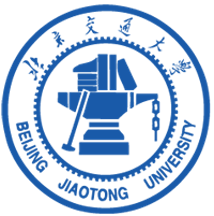

  <!-- Logo -->
  

# ⚡ AgentHive
### Autonomous LLM agents for complex tasks and system analysis

   
   
   
  

---

##  🧬 AgentHive — Core Framework

AgentHive is the core multi-agent runtime and framework for this organization. It provides task decomposition, agent orchestration, planning, and tool integration. AgentHive supplies a consistent execution model and extensible tool interfaces so higher-level applications can implement complex automated security and system-analysis workflows in a modular and reproducible way.

Quick links & highlights:

- Repository: [AgentHive](https://github.com/bjtu-SecurityLab/AgentHive)
- Key capabilities: task decomposition, multi-agent orchestration, tool adapters, reproducible workflows
- Use cases: automated firmware analysis, binary & source auditing, large-scale experiment platforms

  <!-- SVG Placeholder for Architecture Diagram (AgentHive) -->
  

---

## Applications (built on AgentHive)

The projects below are applications that build on top of AgentHive. They reuse AgentHive's orchestration, tool interfaces, and workflow control to provide domain-specific automation.

### 🔧 FirmHive — Autonomous Firmware Analysis

FirmHive is an application built on top of AgentHive focused on automated firmware extraction, static/dynamic analysis, and reverse-engineering workflows. FirmHive composes AgentHive agents to orchestrate toolchains (e.g., binwalk, QEMU, automated Ghidra/IDA scripts) and runs analysis tasks in scalable parallel environments.

- Repository: [FirmHive](https://github.com/bjtu-SecurityLab/FirmHive)
- Typical uses: firmware extraction, filesystem parsing, symbolication and vulnerability localization, automated reverse-engineering pipelines

### 🛡️ VulnLLM — Vulnerability Discovery & Triage

VulnLLM is built on AgentHive to provide automated vulnerability discovery, risk scoring, and initial triage workflows for binaries and source code. It combines static analysis, fuzzing, and LLM-driven semantic reasoning to create a scalable pipeline for finding and validating issues.

- Repository: [VulnLLM](https://github.com/bjtu-SecurityLab/VulnLLM)
- Typical uses: automated vulnerability detection, exploit-chain analysis, deduplication and prioritization of alerts

---

## 🔬 Research Themes

- 🤖 Autonomous LLM Agents for Security Analysis  
- 🧠 Multi-Agent Collaboration & Task Decomposition  
- 📦 Firmware & Embedded Security Analysis  
- 🧵 Binary / Semantic Vulnerability Detection  
- 🛠️ Tool-Augmented LLM Reasoning  
- 💾 Reproducible Benchmarks for Autonomous Agents  
- 🌐 System-level Automation & Large-Scale Analysis  

---

## 🗂 Coming Soon: HiveBench & HiveData

### HiveBench
Benchmark suite for:  
- Autonomous multi-agent systems  
- Firmware & vulnerability analysis  
- Tool-augmented problem solving  

### HiveData
Structured dataset for:  
- Firmware corpora  
- Vulnerability samples  
- Multi-step agent trajectories  
- Experiment logs & evaluation tasks  

---

## 🤝 Contributing

We welcome collaborations in:

- AgentHive ecosystem extensions  
- New agent modules  
- Benchmark & dataset contributions  
- Research collaboration  

Feel free to open issues and PRs.

📧 **Contact:** qiangcass@gmail.com

---

## 📜 License

Most repositories are released under **Apache License 2.0** or equivalent permissive licenses.
